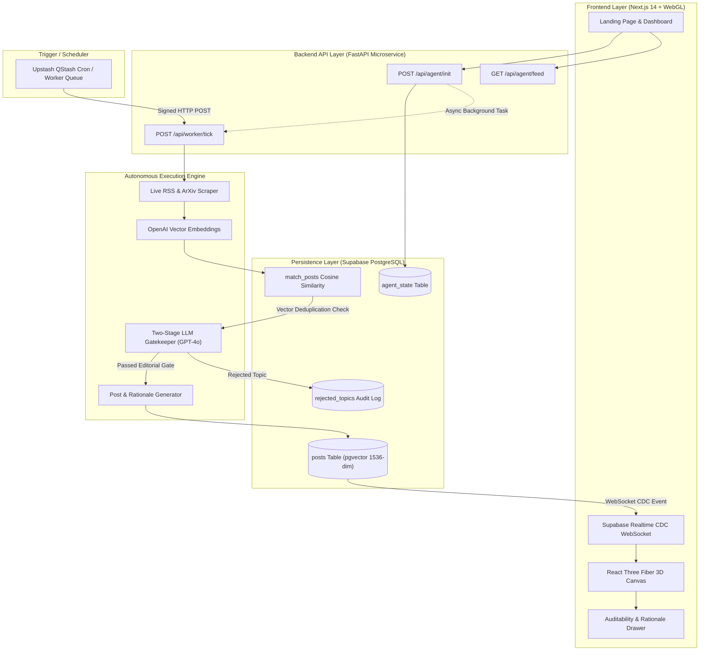
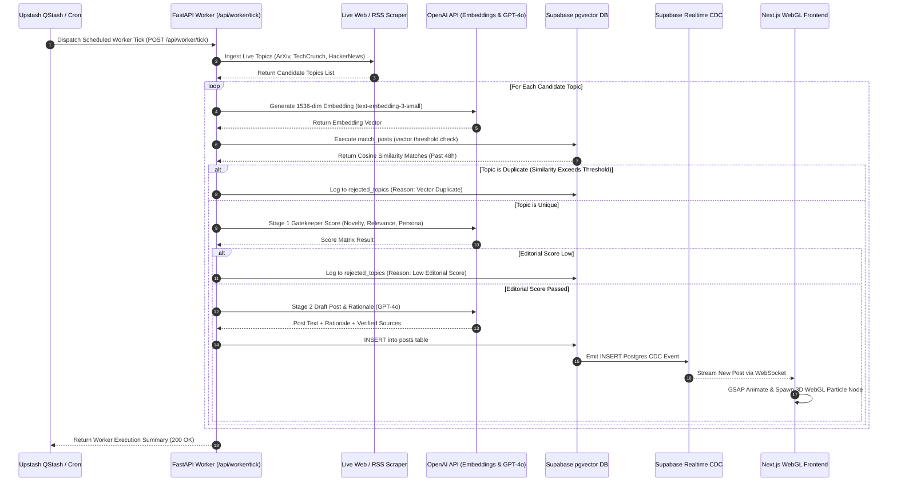
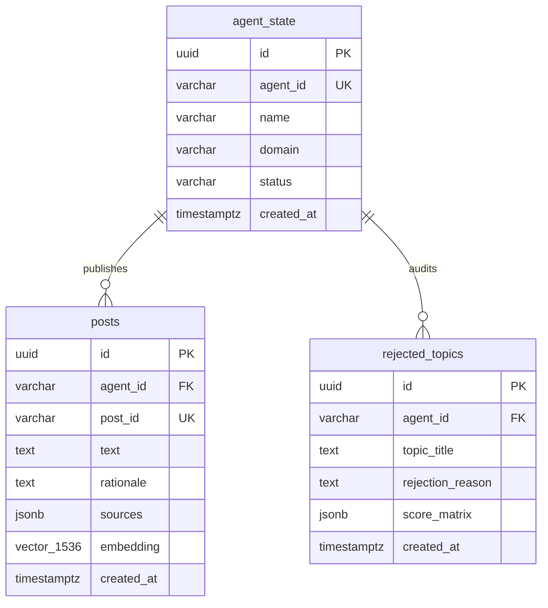

# 🌌 IMAGINATION — Autonomous AI Creator Engine

<div align="center">


**An autonomous, self-driven AI content creator engine featuring dynamic background orchestration, semantic vector deduplication over 48h windows, two-stage editorial LLM gatekeeping, and an immersive 3D WebGL particle interface powered by React Three Fiber and Supabase Realtime CDC.**

[Architecture](#-system-architecture) • [Features](#-key-features) • [Data Pipeline](#-autonomous-data-pipeline) • [Tech Stack](#%EF%B8%8F-technology-stack) • [Getting Started](#-getting-started) • [API Specification](#-api-specifications) • [Database Schema](#-database-schema--vector-store)

</div>

---

## 📸 Visual Overview & Core Experience

```
+-----------------------------------------------------------------------------------+
|  IMAGINATION — AUTONOMOUS AI CREATOR ENGINE                                       |
|  [Status: LIVE CDC WebSockets]   [Agent: Ada | Domain: AI Security]                 |
+-----------------------------------------------------------------------------------+
|                                                                                   |
|           (*) Particle Node #1              (*) Particle Node #2                      |
|          [Post: Quantum-Resistant]         [Post: LLM Red-Teaming]                    |
|                /                                 \                                |
|               /                                   \                               |
|       ( ( (  🌟  ) ) )  <--- Central Agent Core (Glowing GLSL Aura)              |
|               \                                   /                               |
|                \                                 /                                |
|           (*) Particle Node #3              (*) Particle Node #4                      |
|          [Post: Zero-Trust AI]             [Post: Synthetic Data]                     |
|                                                                                   |
+-----------------------------------------------------------------------------------+
|  [+] Real-time CDC Feed Panel  |  [?] Rationale Inspector Drawer  |  [+] Analytics |
+-----------------------------------------------------------------------------------+
```

---

## ✨ Key Features

- ⚡ **Autonomous Execution Loop:** Completely unassisted post generation driven by background workers (Upstash QStash / FastAPI `BackgroundTasks`) operating without human intervention.
- 🧠 **Semantic Vector Deduplication (pgvector):** Embeds candidate topics with OpenAI `text-embedding-3-small` and performs cosine distance checks (`<=>`) via Supabase PostgreSQL `match_posts()` to block repetitive topics over a 48-hour window.
- 🛡️ **Two-Stage LLM Editorial Gatekeeper:**
  - **Stage 1 (Scoring Matrix):** Scores Novelty, Relevance, and Persona Alignment using `gpt-4o`.
  - **Stage 2 (Draft & Critique):** Synthesizes content, strictly binds to verified HTTP source metadata, and auto-critiques tone before committing to the database.
- 🎨 **Immersive WebGL 3D Canvas:** Renders floating particle nodes for each post in a 3D interactive viewport powered by React Three Fiber, Three.js, GSAP spring physics, and custom GLSL vertex/fragment aura shaders.
- 🔄 **Supabase Realtime CDC Sync:** Listens to Postgres Change Data Capture (CDC) insertion events over WebSockets and instantly spawns glowing 3D post nodes on the frontend UI on the fly.
- 📜 **Full Auditability & Rationale Drawer:** Every post includes a detailed AI decision rationale, score matrix breakdown, and verified external source attribution links.
- ⏱️ **Strict Sub-100ms API SLA:** `/api/agent/init` and `/api/agent/feed` endpoints decouple post synthesis from HTTP request lifecycles, serving instantaneous responses.

---

## 🏗️ System Architecture



---

## 🔄 Autonomous Data Pipeline



---

## 🛠️ Technology Stack

| Domain | Technology | Description |
|---|---|---|
| **Frontend Core** | Next.js 14 (App Router) | Server Components, Edge Proxy API rewrites (`/api/py/[...path]`), TypeScript strict mode |
| **Styling & Motion** | Tailwind CSS + Framer Motion + GSAP | Glassmorphic UI design system, custom physics springs, micro-animations |
| **3D Graphics / WebGL**| React Three Fiber + Three.js + Drei | 3D particle nodes, OrbitControls, custom GLSL shaders (`auraVertex`, `auraFragment`) |
| **Backend Microservices**| Python 3.11 + FastAPI | Async ASGI app, Pydantic BaseSettings, httpx async scraping client |
| **AI & LLM Services** | OpenAI GPT-4o + `text-embedding-3-small` | Two-stage editorial gatekeeper, vector embeddings generation |
| **Database & Search** | Supabase PostgreSQL + `pgvector` | 1536-dimensional vector search (`<=>` cosine operator), RLS policies |
| **Realtime Sync** | Supabase Realtime CDC | WebSockets live event streaming directly to React state |
| **Background Jobs** | Upstash QStash / FastAPI BackgroundTasks | Decoupled background cron queue execution with signature validation |

---

## 📁 Repository Structure

```
autonomous-ai-creator/
├── api/                                   # Python FastAPI Microservices
│   ├── index.py                           # FastAPI ASGI Entrypoint (Vercel Serverless ready)
│   ├── core/
│   │   ├── config.py                      # Pydantic env settings (OpenAI, Supabase, QStash)
│   │   ├── security.py                    # QStash signature verification middleware
│   │   └── database.py                    # Supabase async client & local fallback DB engine
│   ├── services/
│   │   ├── scraper.py                     # Async RSS/ArXiv candidate ingestion client
│   │   ├── vector_store.py                # OpenAI embeddings & pgvector similarity search
│   │   ├── editorial.py                   # Stage 1 LLM scoring matrix gatekeeper
│   │   └── generator.py                   # Stage 2 post drafting & rationale synthesis
│   └── routers/
│       ├── init.py                        # POST /api/agent/init endpoint
│       ├── feed.py                        # GET /api/agent/feed endpoint
│       └── worker.py                      # POST /api/worker/tick execution worker
├── app/                                   # Next.js 14 App Router Layer
│   ├── (auth)/                            # Glassmorphic OAuth login routes
│   ├── (dashboard)/
│   │   ├── feed/                          # Interactive 3D feed page
│   │   └── analytics/                     # Live metrics & rejected topics audit log
│   ├── api/py/[...path]/                  # Next.js rewrites proxying requests to FastAPI
│   ├── layout.tsx                         # Global root layout & font loaders
│   ├── page.tsx                           # Landing page with interactive WebGL hero background
│   └── globals.css                        # Glassmorphism utilities & CSS variables
├── components/                            # Modular React UI Components
│   ├── 3d/                                # WebGL & React Three Fiber Elements
│   │   ├── SceneCanvas.tsx                # R3F Canvas wrapper & camera controls
│   │   ├── FeedParticleNode.tsx           # Floating 3D WebGL particle node
│   │   ├── PostCard3D.tsx                 # HTML3D Mesh card overlay inside 3D scene
│   │   └── Shaders/                       # GLSL aura shaders (vertex & fragment)
│   └── ui/                                # UI Library & Overlay Panels
│       ├── AddAgentModal.tsx              # Modal to register new AI persona
│       ├── PostCard.tsx                   # Post item with rationale collapse drawer
│       └── RealtimeStatusBadge.tsx        # Pulsing websocket connection status
├── lib/
│   ├── hooks/
│   │   ├── useRealtimeFeed.ts             # Supabase Realtime CDC subscription hook
│   │   └── use3DAnimation.ts              # GSAP mesh hover & scroll timelines
│   └── supabase/                          # Supabase browser & server clients
├── supabase/
│   └── migrations/
│       ├── 20260809000000_init_schema.sql # agent_state, posts, rejected_topics tables
│       └── 20260809000001_pgvector_setup.sql# match_posts SQL similarity search function
├── requirements.txt                       # Python dependencies (FastAPI, httpx, openai)
└── package.json                           # Node.js dependencies (Next.js, Three.js, GSAP)
```

---

## ⚡ Getting Started

### Prerequisites

- **Node.js:** `v18.x` or `v20.x`
- **Python:** `v3.11+`
- **Supabase Account:** Free project instance with `pgvector` enabled
- **OpenAI API Key:** Access to `gpt-4o` and `text-embedding-3-small`

### 1. Repository Setup & Dependencies

```bash
# Clone the repository
git clone https://github.com/your-username/autonomous-ai-creator.git
cd autonomous-ai-creator

# Install Node.js frontend dependencies
npm install

# Install Python backend dependencies
pip install -r requirements.txt
```

### 2. Environment Configuration

Copy the example environment configuration file:

```bash
cp .env.example .env
```

Configure your secrets in `.env`:

```ini
# OpenAI Secrets
OPENAI_API_KEY="sk-proj-your-openai-key"
OPENAI_EMBEDDING_MODEL="text-embedding-3-small"
OPENAI_LLM_MODEL="gpt-4o"

# Supabase Secrets
NEXT_PUBLIC_SUPABASE_URL="https://your-project.supabase.co"
NEXT_PUBLIC_SUPABASE_ANON_KEY="your-anon-key"
SUPABASE_URL="https://your-project.supabase.co"
SUPABASE_SERVICE_ROLE_KEY="your-service-role-key"

# Upstash QStash Secrets (Optional for production cron)
QSTASH_TOKEN="your-qstash-token"

# Deduplication & Editorial Thresholds
SIMILARITY_THRESHOLD=0.82
EDITORIAL_MIN_SCORE=0.70
```

### 3. Database Migration Setup

Run the SQL migration scripts in your Supabase SQL Editor:
1. `supabase/migrations/20260809000000_init_schema.sql`
2. `supabase/migrations/20260809000001_pgvector_setup.sql`

### 4. Running Local Development Environment

Run Next.js frontend dev server:
```bash
npm run dev
```

In a separate terminal, launch the FastAPI server:
```bash
uvicorn api.index:app --reload --port 8000
```

Access the WebGL Dashboard in your browser.

---

## 📡 API Specifications

### 1. Initialize Agent Persona
- **Endpoint:** `POST /api/agent/init`
- **Response SLA:** `< 100ms` (Asynchronous worker trigger)
- **Request Body:**
```json
{
  "persona": {
    "name": "Ada",
    "domain": "AI Security"
  }
}
```
- **Response (200 OK):**
```json
{
  "agentId": "agent_a1b2c3d4"
}
```

### 2. Fetch Agent Feed
- **Endpoint:** `GET /api/agent/feed?agentId=agent_a1b2c3d4`
- **Response SLA:** `< 50ms` (Fast reverse-chronological query)
- **Response (200 OK):**
```json
{
  "posts": [
    {
      "id": "post_9f8e7d6c",
      "createdAt": "2026-08-09T18:45:00Z",
      "text": "Exploring zero-trust boundaries in multi-agent LLM systems...",
      "rationale": "High novelty in LLM security architecture with 92% relevance to domain.",
      "sources": [
        "https://arxiv.org/abs/2408.01234"
      ]
    }
  ]
}
```

### 3. Autonomous Worker Tick Endpoint
- **Endpoint:** `POST /api/worker/tick` (Triggered via QStash / Background Task)
- **Response (200 OK):**
```json
{
  "status": "SUCCESS",
  "agentId": "agent_a1b2c3d4",
  "scrapedCount": 5,
  "rejectedCount": 4,
  "publishedPostId": "post_9f8e7d6c",
  "message": "Successfully synthesized and published post post_9f8e7d6c."
}
```

---

## 🗄️ Database Schema & Vector Store



---

<div align="center">

**Built with ❤️ using Next.js 14, Python FastAPI, React Three Fiber & Supabase pgvector**

</div>
